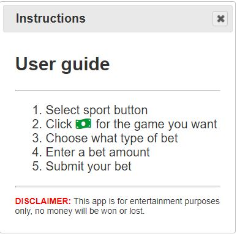

# Sports Betting Simulator


## 1️⃣ Tasks

---

- Create a responsive sports gaming application that gives users a real live-time betting experience.
- This app will run in the browser and feature updated HTML and CSS powered by Javascript and JQuery.
- Users “betting history" will be saved to local storage.

**USER STORY**

```
As a Sports fan I WANT an application that can provide sports gambling simulation.
```

## 📋 Acceptance Criteria

---

- WHEN I open the page I am directed to a homepage
- WHEN I click on a sports category
- THEN The games scheduled for the current day are displayed
- THEN The standings for the current league are displayed
- WHEN I click the game
- THEN A dialog box opens with all of my betting options
- WHEN I select a bet option and enter a dollar amount, my potential winnings are displayed
- WHEN I click on a save button
- THEN my bet options are saved to local storage
- WHEN I click to view the history, my previous bets are displayed

## 📸 Screenshots

---

Homepage


Schedules and Standings


Instructions/Disclaimer



---

Final results: [Sports Betting Simulator](https://malmason.github.io/workday-scheduler/)

## 📱 Contacts

---

Malcolm Mason - [Github](https://github.com/malmason) Email: [Malcolm](mailto:malmason66@gmail.com) 📧

Greg Davis - [Github](https://github.com/g) Email: [Greg](mailto:greggd1991@gmail.com) 📧

Marlon Pierre - [Github](https://github.com/mpierre24) Email: [Marlon](mailto:pierremlox@gmail.com) 📧

Alain Tagne - [Github](https://github.com/AlCharl88) Email: [Alain](mailto:alctagne@gmail.com) 📧
